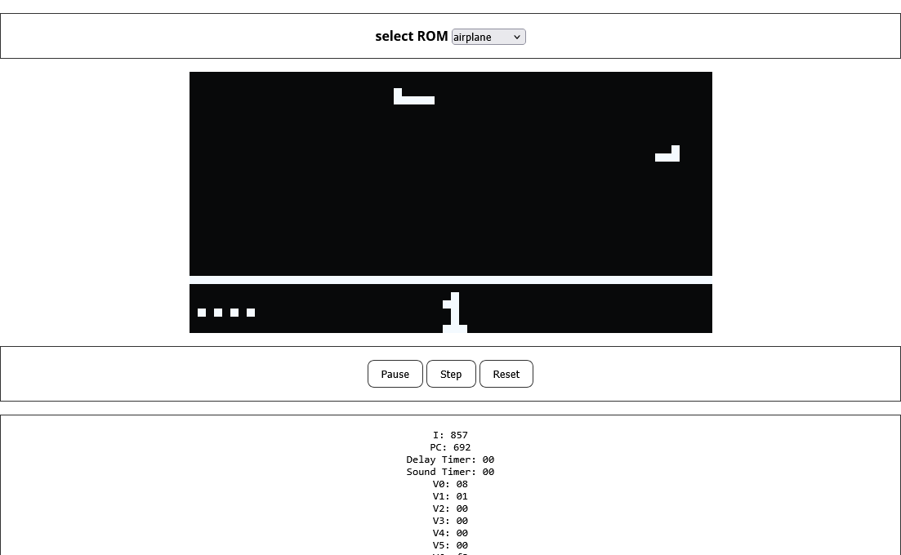

---

# CHIP-8 Emulator

Experience the classic CHIP-8 system right in your browser! This emulator faithfully runs CHIP-8 programs, offering a glimpse into retro computing.

---

## 🚀 Features
- 🕹️ Runs CHIP-8 programs smoothly in the browser
- 🎨 Customizable display and controls
- ⌨️ **Keyboard Input**: Use your computer's keyboard for interactive gameplay
- 🔊 **Sound**: Enjoy basic sound effects when running CHIP-8 programs

## 🎮 Try it Out
Run CHIP-8 games and programs directly from your browser:  
👉 [Launch Emulator](https://sjnprjl.github.io/chip8-emulator/)

## 🔧 How It Works
This emulator interprets CHIP-8 bytecode, handling:
- CPU emulation
- Memory management
- Input processing (with keyboard support)
- Display rendering
- Sound emulation for basic audio effects

## 📷 Screenshots


## 🛠️ Installation & Development
Want to tweak the emulator or contribute? Clone the repo and start hacking!
```bash
git clone https://github.com/sjnprjl/chip8-emulator.git
cd chip8-emulator
npm install
npm run dev
```

## 📜 License
MIT License – Free to use, modify, and share!

## 🌟 Support & Feedback
If you like this project, give it a ⭐ on GitHub!

💬 Found a bug or have a suggestion? Open an issue or reach out to me!

---

## 📚 Resources

### Chip8 Technical References
- A comprehensive guide detailing the architecture, instruction set, and implementation of CHIP-8:  
  [Chip8 Technical References](http://devernay.free.fr/hacks/chip8/C8TECH10.HTM)

### CHIP-8 Test Suite
- A collection of tests designed to validate the functionality of a CHIP-8 emulator:  
  [Chip8 Test Suite](https://github.com/Timendus/chip8-test-suite)

### COSMAC VIP Manual
- The original instruction manual for the COSMAC VIP system, the hardware platform for CHIP-8:  
  [COSMAC VIP Manual (PDF)](http://www.bitsavers.org/components/rca/cosmac/COSMAC_VIP_Instruction_Manual_1978.pdf)

---